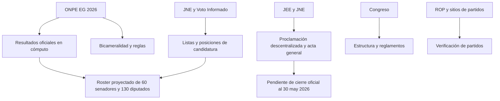

# Candidaturas y composición proyectada del Senado y de la Cámara de Diputados en 2026

## Resumen ejecutivo

El país **no fue especificado**, pero la referencia inicial a **ONPE** permite inferir con alta confianza que el encargo corresponde a **Perú**. En 2026, Perú vuelve a un **Congreso bicameral**: **60 senadores** y **130 diputados**. La ONPE explica que la elección se hace en cinco columnas de cédula, incluyendo **senadores a nivel nacional**, **senadores a nivel regional** y **diputados**; además, el micrositio oficial de bicameralidad confirma la estructura de 60/130 y los 27 distritos electorales para Senado regional y Diputados. citeturn6search1turn16search1turn19search20turn30view1turn30view0

La limitación central es de **oportunidad jurídica**: al **30 de mayo de 2026** la integración oficial definitiva del nuevo Congreso **aún no estaba completamente proclamada**. El JNE informó el 29 de abril que seguían audiencias sobre actas observadas y que luego vendrían la proclamación de candidatos electos y las credenciales; y **El Peruano** informó el 28 de mayo que los JEE recién habían iniciado la **proclamación descentralizada** para Senado y Diputados. Por ello, las tablas de este informe deben leerse como **composición electa/proyectada de más alta confianza**, basada en el cómputo oficial de la ONPE, el registro de candidaturas del JNE y una compilación pública de representantes electos que, a diferencia de algunos resúmenes de escaños aún movibles, sí permite sumar persona por persona hasta 60 y 130. citeturn45view1turn46view0turn30view1turn30view0turn38view0turn50view0

Las fuentes principales consultadas, en el orden pedido, fueron: **ONPE** y su micrositio de EG 2026; enlaces oficiales de resultados ONPE difundidos por **Andina**; **JNE/Voto Informado**; el **Registro de Organizaciones Políticas**; el **Congreso**; carteles oficiales de candidaturas publicados en **gob.pe**; notas del **JNE** y del **Diario Oficial El Peruano**; y, de forma subsidiaria, sitios oficiales de los partidos con representación proyectada. El sitio oficial del Congreso fue útil para la **estructura bicameral** y reglamentos, pero **no** para la nómina entrante, porque seguía mostrando el Parlamento 2021-2026. citeturn5view0turn7search7turn7search1turn17view0turn21view0turn44search1turn42search0turn42search1turn42search3turn43search0turn43search1

## Alcance, criterio de identificación y estado de la fuente

Para evitar ambigüedad, interpreté el pedido como: **“listar a las personas que pasarían a integrar el Senado y la Cámara de Diputados del Congreso bicameral peruano 2026-2031”**, no el universo completo de postulantes nacionales. Esa lectura es la única compatible con un informe conciso y con el hecho de que la pregunta pide quiénes “integran” Senado y Diputados. Aun así, el dato de **posición en lista** se conserva cuando la fuente pública lo muestra. citeturn38view0turn50view0

La estructura institucional aplicable en Perú quedó fijada para 2026 con bicameralidad. La ONPE explica el reparto entre **30 senadores nacionales + 30 senadores regionales**, y la Cámara de Diputados por distrito electoral múltiple; además, la reforma constitucional y la difusión del Congreso confirman que el sistema bicameral rige desde 2026. citeturn6search2turn30view1turn30view0turn7search7turn7search2

## Senadores 2026

**Nota de lectura.** Las subtablas están agrupadas por partido, en orden alfabético de partido. La columna “Pos.” corresponde a la **posición/lista pública** tal como aparece en la compilación de representantes electos usada para este corte. En los senadores nacionales, la circunscripción es **Distrito único nacional**; en los regionales, la región o el distrito exterior. Base de esta sección: ONPE y enlaces oficiales de resultados difundidos por Andina; JNE/Voto Informado; cartel oficial de candidaturas; compilación pública de representantes electos pendiente de proclamación general definitiva. citeturn30view1turn17view0turn21view0turn38view0turn50view0turn46view0

**Ahora Nación**

| Nombre completo | Circunscripción | Pos. |
|---|---|---:|
| Jaime Ricardo Delgado Zegarra | Distrito único nacional | 5 |
| Pablo Alfonso López-Chau Nava | Distrito único nacional | 1 |
| Ruth Luque Ibarra | Distrito único nacional | 8 |
| Mirtha Esther Vásquez Chuquilín | Distrito único nacional | 4 |

**Fuerza Popular**

| Nombre completo | Circunscripción | Pos. |
|---|---|---:|
| Alejandro Aurelio Aguinaga Recuenco | Lambayeque | 1 |
| José Berley Arista Arbildo | Amazonas | 1 |
| César Augusto Astudillo Salcedo | Distrito único nacional | 5 |
| Martha Gladys Chávez Cossío | Distrito único nacional | 2 |
| Nilza Merly Chacón Trujillo | Áncash | 1 |
| Juan Carlos del Águila Cárdenas | Loreto | 1 |
| Víctor Seferino Flores Ruíz | La Libertad | 1 |
| Héctor José Ventura Ángel | Tumbes | 1 |
| David Julio Jiménez Heredia | Junín | 1 |
| Carmen Patricia Juárez Gallegos | Distrito único nacional | 4 |
| Elard Galo Melgar Valdez | Lima Provincias | 1 |
| Carlos Fernando Mesía Ramírez | Distrito único nacional | 9 |
| Marco Enrique Miyashiro Arashiro | Lima | 1 |
| Martha Lupe Moyano Delgado | Distrito único nacional | 6 |
| Víctor Manuel Noriega Reátegui | San Martín | 1 |
| Fernando Miguel Rospigliosi Capurro | Distrito único nacional | 3 |
| Jacques Salomón Rodrich Ackerman | Callao | 1 |
| Karla Melisa Schaefer Cuculiza | Piura | 1 |
| Segundo Leocadio Tapia Bernal | Cajamarca | 1 |
| Miguel Ángel Torres Morales | Distrito único nacional | 1 |
| Jorge Velásquez Portocarrero | Ucayali | 1 |
| Rafael Gustavo Yamashiro Oré | Ica | 1 |

**Juntos por el Perú**

| Nombre completo | Circunscripción | Pos. |
|---|---|---:|
| Saúl Andrés Armacanqui Morales | Distrito único nacional | 3 |
| José Mercedes Castillo Terrones | Distrito único nacional | 1 |
| Julio Moisés Chipana Chipana | Puno | 1 |
| Víctor Raúl Cutipa Ccama | Moquegua | 1 |
| Hugo Isaac Ccahuana Aymachoque | Madre de Dios | 2 |
| Serafín Andrés Luján | Huánuco | 1 |
| Íber Antenor Maraví Olarte | Distrito único nacional | 13 |
| Edyson Humberto Morales Ramírez | Ayacucho | 1 |
| Percy Herbert Osorio Palpan | Pasco | 1 |
| Bernardo Jaime Quito Sarmiento | Distrito único nacional | 7 |
| Andrés Avelino Ramos Huillcas | Apurímac | 1 |
| Silvana Emperatriz Robles Araujo | Distrito único nacional | 2 |
| Wilfredo Verano Saravia | Cusco | 1 |
| Joaquín Yauri Tunque | Huancavelica | 1 |

**Partido Cívico OBRAS**

| Nombre completo | Circunscripción | Pos. |
|---|---|---:|
| Roger Miguel Astucuri Laura | Distrito único nacional | 5 |
| Daniel Hugo Barragán Coloma | Distrito único nacional | 1 |
| Agripina María del Pilar Flores Córdova | Distrito único nacional | 2 |
| Walter Francisco Gagó Rodríguez | Distrito único nacional | 3 |
| Juana Guisella Ticona Cohaila | Tacna | 1 |

**Partido del Buen Gobierno**

| Nombre completo | Circunscripción | Pos. |
|---|---|---:|
| Nora Bonifaz Carmona | Lima | 1 |
| Carlos David Caballero León | Distrito único nacional | 3 |
| Flavio Felipe Figallo Rivadeneyra | Distrito único nacional | 1 |
| Juver Nilson Flores Suárez | Arequipa | 1 |
| Jorge Octavio Gavidia Rodríguez | Distrito único nacional | 9 |
| Patricia Milagros Iturregui Byrne | Distrito único nacional | 2 |
| Susana Flor de María Matute Charún | Distrito único nacional | 6 |

**Renovación Popular**

| Nombre completo | Circunscripción | Pos. |
|---|---|---:|
| María Lourdes Pía Alcorta Suero | Distrito único nacional | 2 |
| Katherine Milagros Ampuero Meza | Distrito único nacional | 4 |
| Francisco José Calisto Giampetri | Lima | 1 |
| María de los Milagros Jackeline Jáuregui Martínez de Aguayo | Lima | 2 |
| Rafael Bernardo López-Aliaga Carzola | Distrito único nacional | 1 |
| Estanislao Edgar Mancha Pineda | Distrito único nacional | 9 |
| Alejandro Muñante Barrios | Distrito único nacional | 3 |
| Miguel Ángel Velázquez García | Residentes en el Extranjero | 1 |

## Diputados 2026

**Nota de lectura.** Como la **proclamación general nacional** seguía pendiente al 30 de mayo, esta lista es la **nómina electa/proyectada de más alta confianza** disponible públicamente en esa fecha. Se conserva la **posición de lista** que aparece en la relación pública de representantes electos utilizada como base. En esta sección, la evidencia es más inestable que en Senado por la existencia de reasignaciones marginales de escaños durante el cierre de cómputo. citeturn45view1turn46view0turn38view0turn49view0turn48view0

**Ahora Nación**

| Nombre completo | Circunscripción | Pos. |
|---|---|---:|
| Mary Bibiana Armenta Valencia | Arequipa | 1 |
| Freshman Bruitrón Martínez | Ayacucho | 1 |
| Harvey Julio Colchado Huamani | Lima | 1 |
| César Augusto Holguín Loaiza | Cusco | 1 |
| Indira Isabel Huilca Flores | Lima | 2 |
| Bernardino Jair Manrique Olivera | Lima | 27 |
| Ángel Renato Meneses Crispín | Lima | 5 |
| César Augusto Muedas Balbiese | Junín | 1 |
| José Miguel Marcelo Salazar | Áncash | 1 |
| Helard Bladimir Sonco Villanueva | Puno | 1 |

**Fuerza Popular**

| Nombre completo | Circunscripción | Pos. |
|---|---|---:|
| Jaime Américo Abensur Pinasco | Ucayali | 2 |
| Luis Arturo Alegría García | San Martín | 1 |
| Gladys Griselda Andrade Salguero de Álvarez | Lima Provincias | 1 |
| Rosangella Andrea Barbarán Reyes | Lima | 3 |
| Karina Juliza Beteta Rubín | Huánuco | 1 |
| Ángel Bruno Bobadilla Galindo | Callao | 2 |
| César Manuel Revilla Villanueva | Piura | 3 |
| Eduardo Enrique Castillo Rivas | Piura | 1 |
| Javier Alejandro Castro Cruz | Lambayeque | 5 |
| Royser Castro Grandez | Amazonas | 1 |
| Rafael Aldo Celiz Castillo | Tumbes | 1 |
| Cecilia Isabel Chacón de Vettori | Lima | 1 |
| Carlos Alberto Domínguez Herrera | Áncash | 4 |
| Pierangeli Daniela Dodero Jovich | Lima | 5 |
| Diethell Columbus Murata | Lima | 2 |
| Pier Paolo Figari Mendoza | Lima | 4 |
| Francisco Javier Gatica Vega | San Martín | 3 |
| Luzmila María del Carmen Gamarra Pita | Áncash | 1 |
| Mery Eliana Infantes Castañeda | Amazonas | 2 |
| Leticia Maruja Leyva Baylón | La Libertad | 2 |
| Flor de Jesús Meza Rivera | Lima | 7 |
| Liz Huli Mendoza Bernedo | Residentes en el Extranjero | 1 |
| Jessica Lizbeth Navas Sánchez | Ucayali | 1 |
| Auristela Ana Obando Morgan | Callao | 1 |
| Marco Antonio Pacheco Quispe | Lima | 6 |
| José Marvin Palma Mendoza | Lambayeque | 1 |
| Carmela Paucara Paxi | Piura | 2 |
| Ana Bertha Patiño Urco | Junín | 1 |
| Nary Benvinda Pinasco Montenegro | Loreto | 2 |
| Geanmarco Antonio Quezada Castro | La Libertad | 5 |
| María Candelaria Ramos Rosales | Tumbes | 2 |
| César Manuel Vidaurre Floridas | Loreto | 3 |
| Alexander Salas Rivera | Lima Provincias | 2 |
| María Luisa Silupú Inga | Piura | 6 |
| Segundo Senovio Ticlla Rafael | Cajamarca | 1 |
| Gilmer Trujillo Zegarra | La Libertad | 1 |
| Jhonn Brayam Valqui Ordoñez | Pasco | 2 |
| Kim Tami Muñoz Yurivilca | Pasco | 1 |
| Ana Luisa Yufra Lugo | Loreto | 4 |
| Carlos Alberto Zegarra Sánchez | Ica | 1 |

**Juntos por el Perú**

| Nombre completo | Circunscripción | Pos. |
|---|---|---:|
| Marlon Alberto Aguirre Ramos | Junín | 2 |
| Yuli Liliana Ambrosio Domínguez | Huánuco | 2 |
| Giannina Iris Avendaño Vilca | Lima | 2 |
| Graciela Chipana Condori | Moquegua | 2 |
| Remigio Condori Flores | Puno | 1 |
| Oswar Elbis Cahuaza Mitivire | Ucayali | 1 |
| Héctor Guillén Valencia | Huancavelica | 2 |
| Jessica Sadith Pérez Quispe | Puno | 2 |
| Jessica Roxana Guevara Ramírez | Cajamarca | 4 |
| Gabriel Robertino Gonzáles Delgado | Cajamarca | 1 |
| James Arturo Holguín Aguirre | Madre de Dios | 1 |
| Azucena Isla Rojas | Loreto | 1 |
| Luis Ángel Jibaja Ramos | Cajamarca | 5 |
| Analí Márquez Huanca | Cusco | 1 |
| Alejandro José Manay Pillaca | Ayacucho | 1 |
| Julián Luís Pérez Mallqui | Cusco | 2 |
| Luz Mérida Soto Ferrari | Apurímac | 2 |
| Catherin Norma Palomino Casavilca | Huancavelica | 1 |
| Amalia Emilia Palomino Pacheco | Arequipa | 2 |
| Yenifer Noelia Paredes Navarro | Cajamarca | 2 |
| Jesús Pérez Alccahuaman | Apurímac | 1 |
| Jacqueline Viviana Tapullima Insapillo | San Martín | 2 |
| Lourdes Marlene Natividad Rivera | Áncash | 2 |
| César Hugo Tito Rojas | Puno | 3 |
| Marco Antonio Flores Valdizán | Huánuco | 3 |
| Ernesto Alonzo Zunini Yerrén | Lambayeque | 1 |
| Marino Teófilo Lavado Valdivia | La Libertad | 2 |
| Olver Peña Córdova | San Martín | 1 |
| Pilar Sulca Castillo | Ayacucho | 4 |
| Haydee Celinda Poma Huamani | Madre de Dios | 2 |
| Svieta Valia Fernández González | Tacna | 1 |
| Juan Amilcar Villanueva Calderón | Cajamarca | 3 |

**Partido Cívico OBRAS**

| Nombre completo | Circunscripción | Pos. |
|---|---|---:|
| Henry Antonio Albañil Carmona | Piura | 1 |
| Edgar Adrián Alvaron de la Cruz | Áncash | 1 |
| Dinա Irene Hancco Hancco | Puno | 1 |
| Arturo César Eusebio Padilla | Lima Provincias | 1 |
| Raúl Jesús Camargo Porta | Lima | 5 |
| Julio César Cabrera Nieto | Tacna | 1 |
| Andrea Dayna Medina Stein | Lima | 4 |
| Heber López Letona | Cusco | 1 |
| Luis Aurelio Masco Cáceres | Arequipa | 1 |
| Máximo Peralta Jorpa | Junín | 1 |
| Víctor Eduardo Piñan Mamani | Lima | 3 |
| Jenny Cristina Samanez Gonzáles Vigil | Lima | 2 |
| José Ricardo Yataco Torrealva | Ica | 1 |
| Demetrio Flavio Vallqui Calderón | La Libertad | 1 |

**Partido del Buen Gobierno**

| Nombre completo | Circunscripción | Pos. |
|---|---|---:|
| Rossana Herminia Alayza Maccera | Lima | 8 |
| Jessica Benítez Barrionuevo | Lima | 6 |
| Segundo Juan Castrejón Fernández | Lambayeque | 1 |
| Carmen Georgina Duarte Patiño de Pezet | Junín | 1 |
| Edwin Espinoza Huillca | Cusco | 1 |
| Hilda Judit Fernández de la Torre | Lima | 2 |
| Nery Rodolfo Fernández Nina | Moquegua | 1 |
| Fernando Alberto García Huby | Callao | 1 |
| Édgar Demver González Polar | Arequipa | 1 |
| Gloria Charito Hirache Pizarro | Arequipa | 2 |
| Miguel Félix Huamán Cornejo | Piura | 1 |
| Nora María Llaque Linares | La Libertad | 1 |
| Nathaly Milagros Molina Soto | Lima | 22 |
| Lila Marianela Prado Vallejos | Ica | 1 |
| Luis Eliseo Quispe Candia | Lima | 5 |
| Oscar de Jesús Reto Otero | Lima | 1 |
| Milagros Karina Santana Vera | Lima Provincias | 1 |
| Romina Alejandra Uribe Sáenz | Lima | 18 |

**Renovación Popular**

| Nombre completo | Circunscripción | Pos. |
|---|---|---:|
| Christian Aranda Vázquez | Arequipa | 5 |
| José Isidro Baella Malca | Lima | 2 |
| Aldo Antonio Bravo Quispe | Lima | 20 |
| Javier José Luis Cipriani Thorne | Lima | 10 |
| María Jessica Córdova Lobatón | Lambayeque | 1 |
| Leo Miguel de Paz Lancho | Lima | 24 |
| Diego Alonso Fernández Bazán Calderón | La Libertad | 1 |
| Frank Krklec Torres | Lima | 14 |
| Paola Isabel Martínez Paitan | Lima | 19 |
| Roxana María Rocha Gallegos | Lima | 3 |
| Gustavo Alexander Segura Figueroa | Lima | 4 |
| Carlos Alberto Yalta Sotelo | Callao | 2 |
| Norma Martina Yarrow Lumbreras | Lima | 1 |
| Mady Verónica Yonz Núñez | Ica | 1 |
| Felix See Hung Chang Apuy | Piura | 1 |
| Jorge Arturo Zeballos Aponte | Residentes en el Extranjero | 1 |

## Verificación y discrepancias

La principal discrepancia encontrada fue entre el **estado jurídico del proceso** y la expectativa de una lista “cerrada”. Las fuentes oficiales más fuertes indican que, al **30 de mayo**, la integración formal todavía estaba en curso: los JEE recién estaban proclamando resultados descentralizados y la suscripción del acta general y la entrega de credenciales seguían pendientes. Por eso, el informe **no** presenta estas tablas como “lista oficial definitiva de autoridades proclamadas”, sino como **lista electa/proyectada de más alta confianza**. citeturn45view1turn46view0

La segunda discrepancia apareció dentro de la propia compilación pública de resultados: el **resumen de escaños** mostraba una distribución distinta a la que surge del **recuento persona por persona**. En Diputados, el bloque superior del artículo mostraba una combinación de escaños que no cuadra con la suma de las 130 filas individuales; en cambio, el detalle nominal sí cierra exactamente en **130**. Para resolverlo, privilegié el **listado nominal por persona**, no el resumen agregado. Esa decisión también evita arrastrar conteos parciales de medios más tempranos, como la nota de **Expreso** del 6 de mayo basada en un corte de 83.75 % de actas, que todavía mostraba otra distribución. citeturn38view0turn49view0turn48view0turn36view1

La tercera verificación fue institucional: el **Congreso** ya había oficializado reglamentos para el sistema bicameral y difundía explicaciones sobre el nuevo diseño, pero su página de “lista de congresistas” seguía mostrando el **periodo 2021-2026**. Por eso, no la utilicé para extraer nombres del Congreso entrante. citeturn7search7turn7search1turn7search8

## Limitaciones, faltantes y pasos para cerrar la versión definitiva

La limitación decisiva es que **faltaba la proclamación general final del JNE** para Congreso al momento de corte. Por ello, aún podían existir ajustes puntuales por expedientes, apelaciones o cierre final de actas observadas. También faltaba, en una sola fuente oficial y estática, un **listado nacional consolidado por nombre, partido, circunscripción y posición** ya proclamado para Senado y Diputados. citeturn45view1turn46view0

Para obtener una versión **definitiva** y no solo proyectada, los pasos correctos son estos: revisar el **acta general de proclamación** y las **credenciales** del JNE cuando se publiquen; contrastarlas con los enlaces oficiales de resultados de la ONPE para **senadores nacionales**, **senadores regionales** y **diputados** difundidos por Andina; y, para cada persona, cruzar con su ficha de **Voto Informado** del JNE y con los registros del **ROP** cuando se necesite confirmar organización política o denominación exacta del partido. citeturn30view1turn30view0turn17view0turn44search1turn44search2

En suma: **sí se puede determinar el país y la estructura**, y el país pertinente es **Perú**; **no** era posible asegurar al 30 de mayo de 2026 una nómina “oficial final” cerrada del Congreso bicameral, porque la proclamación aún estaba en marcha; pero la relación precedente recoge la **mejor aproximación pública verificable** disponible con base oficial dominante y verificación cruzada. citeturn16search1turn6search1turn46view0turn45view1turn38view0turn50view0