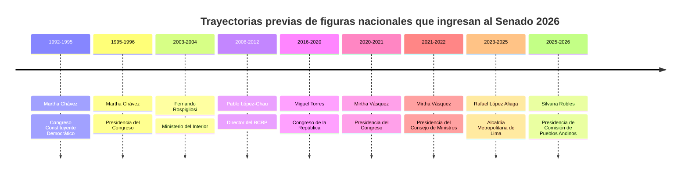

# Congreso bicameral del Perú 2026

## Resumen ejecutivo

Al 30 de mayo de 2026, el Congreso bicameral peruano **todavía no tiene un acta general definitiva del JNE**, aunque la ONPE ya entregó al Jurado Nacional de Elecciones la base de datos de actas de senadores, diputados y demás elecciones, y los JEE ya iniciaron la **proclamación descentralizada** con reportes al **100 % de actas contabilizadas**. Por eso, la integración que sigue debe entenderse como una **fotografía técnica de electos proyectados o virtuales** sobre la base del cómputo completo y de listados públicos de electos que todavía pueden sufrir ajustes puntuales hasta que el Pleno del JNE suscriba el acta general y entregue credenciales. citeturn44view0turn43view0

La estructura del nuevo Parlamento es de **60 senadores y 130 diputados**, primera restauración de la bicameralidad en más de tres décadas; los 60 escaños senatoriales se reparten entre **30 de distrito nacional único** y **30 de distritos múltiples**, mientras que la Cámara de Diputados mantiene **130 curules distritales**. citeturn0search1turn0news37

En la versión indexada y más estable del recuento público consultado, **Fuerza Popular** aparece como la primera fuerza parlamentaria; **Juntos por el Perú** como la segunda; y ninguna organización alcanza mayoría propia, por lo que el próximo gobierno —y el propio Congreso— dependerán de acuerdos interpartidarios. En el paneo agregado de esa versión, la distribución proyectada era: **Senado**: Fuerza Popular 22, Juntos por el Perú 14, Renovación Popular 8, Partido del Buen Gobierno 7, Partido Cívico OBRAS 5 y Ahora Nación 4; **Diputados**: Fuerza Popular 41, Juntos por el Perú 32, Partido del Buen Gobierno 18, Renovación Popular 15, Partido Cívico OBRAS 14 y Ahora Nación 10. citeturn8view0turn0news37turn42news29

La huella previa de los electos es muy heterogénea. En el Senado ingresan figuras de larga carrera nacional —como Martha Chávez, Fernando Rospigliosi, Rafael López Aliaga, Pablo López-Chau o Mirtha Vásquez— junto con perfiles de menor exposición pública y trayectorias principalmente profesionales o regionales. En Diputados se observa un patrón más marcado de **liderazgos territoriales**, exregidores, excongresistas, exfuncionarios, exoficiales policiales y dirigentes locales. También aparecen varios casos con **cuestionamientos públicos, sanciones declaradas, procesos o controversias mediáticas**, pero la intensidad y verificabilidad de esos antecedentes varía mucho entre personas. citeturn22view0turn40search3turn39search2turn16search5turn18view0turn18view1

## Estado oficial del proceso y criterio de trabajo

La ONPE informó el 9 de mayo de 2026 que ya había remitido al JNE la base de datos de actas electorales para las cinco elecciones de la jornada general y que puso a disposición un sistema de resultados y descarga masiva de actas. El JNE, por su parte, informó el 28 de mayo que los JEE comenzaron la proclamación descentralizada de resultados para Senado, Diputados y Parlamento Andino, y que **solo después** de culminada esa fase corresponderá al Pleno del JNE suscribir el acta general y entregar credenciales. citeturn44view0turn43view0

Por esa razón, en este informe distingo entre **datos de estructura institucional y estado del proceso** —tomados de ONPE y JNE— y **nóminas de electos y perfiles individuales** —reconstruidos con la lista pública indexada de electos y, para biografías y antecedentes, con perfiles públicos de candidatos, hojas de vida indexadas, fichas oficiales o semioficiales y notas de prensa de medios nacionales—. Donde una fuente abierta e indexada no permitió corroborar un dato biográfico individual al 30 de mayo, consigno **“no especificado”** en lugar de completar con inferencias. citeturn44view0turn43view0turn8view0turn22view0turn18view0turn18view1turn23view0turn23view1

## Composición proyectada por cámara y partido

| Partido | Senado | Diputados | Total proyectado |
|---|---:|---:|---:|
| Fuerza Popular | 22 | 41 | 63 |
| Juntos por el Perú | 14 | 32 | 46 |
| Partido del Buen Gobierno | 7 | 18 | 25 |
| Renovación Popular | 8 | 15 | 23 |
| Partido Cívico OBRAS | 5 | 14 | 19 |
| Ahora Nación | 4 | 10 | 14 |

Esta tabla reproduce la composición agregada que aparece en la versión indexada del escrutinio parlamentario consultado. La propia coyuntura oficial —proclamación descentralizada todavía en curso— obliga a leerla como **composición proyectada** hasta la emisión del acta general del JNE. citeturn8view0turn43view0turn44view0

En síntesis política, el Senado y la Cámara de Diputados quedarían fragmentados en **seis fuerzas con representación**, con preeminencia de Fuerza Popular y Juntos por el Perú, pero sin bloque mayoritario autosuficiente. citeturn8view0turn0news37

## Senado

La nómina pública indexada de senadores electos o proyectados permite reconstruir, por partido, la siguiente integración.

**Fuerza Popular**: Miguel Ángel Torres Morales, Martha Gladys Chávez Cossío, Fernando Miguel Rospigliosi Capurro, Carmen Patricia Juárez Gallegos, Martha Lupe Moyano Delgado, César Augusto Astudillo Salcedo, Carlos Fernando Mesía Ramírez; José Berley Arista Arbildo, Nilza Merly Chacón Trujillo, Segundo Leocadio Tapia Bernal, Jacques Salomón Rodrich Ackerman, Rafael Gustavo Yamashiro Oré, David Julio Jiménez Heredia, Víctor Seferino Flores Ruíz, Alejandro Aurelio Aguinaga Recuenco, Marco Enrique Miyashiro Arashiro, Elard Galo Melgar Valdez, Juan Carlos del Águila Cárdenas, Karla Melisa Schaefer Cuculiza, Víctor Manuel Noriega Reátegui, Héctor José Ventura Ángel y Jorge Velásquez Portocarrero. citeturn10view1turn11view0

**Juntos por el Perú**: José Mercedes Castillo Terrones, Silvana Emperatriz Robles Araujo, Bernardo Jaime Quito Sarmiento, Saúl Andrés Armacanqui Morales, Íber Antenor Maraví Olarte; Andrés Avelino Ramos Huillcas, Edyson Humberto Morales Ramírez, Wilfredo Verano Saravia, Joaquín Yauri Tunque, Serafín Andrés Luján, Hugo Isaac Ccahuana Aymachoque, Víctor Raúl Cutipa Ccama, Percy Herbert Osorio Palpan y Julio Moisés Chipana Chipana. citeturn10view1turn11view0

**Renovación Popular**: Rafael Bernardo López-Aliaga Carzola, Alejandro Muñante Barrios, Katherine Milagros Ampuero Meza, María Lourdes Pía Alcorta Suero, Estanislao Edgar Mancha Pineda; Francisco José Calisto Giampetri, María de los Milagros Jackeline Jáuregui Martínez de Aguayo y Miguel Ángel Velázquez García. citeturn10view1turn11view0

**Partido del Buen Gobierno**: Flavio Felipe Figallo Rivadeneyra, Patricia Milagros Iturregui Byrne, Susana Flor de María Matute Charún, Carlos David Caballero León, Jorge Octavio Gavidia Rodríguez; Juver Nilson Flores Suárez y Nora Bonifaz Carmona. citeturn10view1turn11view0

**Partido Cívico OBRAS**: Daniel Hugo Barragán Coloma, Agripina María del Pilar Flores Córdova, Walter Francisco Gagó Rodríguez, Roger Miguel Astucuri Laura y Juana Guisella Ticona Cohaila. citeturn10view1turn11view0

**Ahora Nación**: Pablo Alfonso López-Chau Nava, Jaime Ricardo Delgado Zegarra, Ruth Luque Ibarra y Mirtha Esther Vásquez Chuquilín. citeturn11view0

En la evidencia abierta consultada, varias de estas figuras ya contaban con trayectorias públicas nacionales antes de esta elección. **Miguel Ángel Torres Morales** nació en Lima el 18 de febrero de 1980, es abogado y catedrático; fue congresista de Fuerza Popular en 2016-2020, vocero político del fujimorismo y figura de confianza del entorno de Keiko Fujimori. Durante la campaña de 2026 fue objeto de observaciones del JEE por presunta información falsa en su DJHV sobre acciones o participaciones. citeturn39search0turn39search4turn16search4turn16search7turn16search13

**Martha Gladys Chávez Cossío** nació en el Callao el 12 de enero de 1953, es abogada por la PUCP, con posgrados declarados en derecho internacional económico y derecho constitucional; fue congresista constituyente y luego congresista en múltiples periodos, además de presidenta del Congreso en 1995. En su DJHV indexada no registra sentencias penales ni por obligaciones, pero en su trayectoria pública carga controversias históricas por su defensa del fujimorismo y por declaraciones sobre el caso La Cantuta. citeturn22view0turn12search4

**Fernando Miguel Rospigliosi Capurro** figura en fuentes oficiales del Congreso como expresidente encargado del Parlamento y exministro del Interior durante el gobierno de Alejandro Toledo; además presidió la Comisión de Constitución. En paralelo, en abril de 2026 circularon reportes sobre una condena en primera instancia por difamación, lo que lo convierte en uno de los senadores con mayor exposición litigiosa reciente. En las fuentes indexadas consultadas para este informe no apareció de forma estable su fecha de nacimiento ni una ficha académica tan completa como la de otros electos. citeturn40search3turn40search7turn40search19

**Rafael Bernardo López-Aliaga Carzola** nació en Lima el 11 de febrero de 1961, es empresario, ingeniero y líder de Renovación Popular; fue regidor de Lima y alcalde metropolitano entre 2023 y 2025 antes de renunciar para postular en 2026. Sus controversias más persistentes son sus deudas tributarias empresariales discutidas con la Sunat y, ya en esta campaña, sus denuncias de fraude y su oferta de dinero a quien presentara pruebas, hecho que derivó en fuertes críticas y denuncias. citeturn39search2turn39news45

**Pablo Alfonso López-Chau Nava** nació el 17 de julio de 1950 en Lima, creció en el Callao, es economista por la Universidad Nacional del Callao y tiene maestría y doctorado en Economía por la UNAM; además fue director del BCRP y rector de la UNI. Durante la campaña de 2026 el JEE advirtió una presunta omisión o información falsa en su hoja de vida respecto de su vínculo con una persona jurídica, cuestión que se volvió uno de los principales cuestionamientos documentados a su candidatura. citeturn16search5turn16search11turn16search17turn41search7

**Jorge Octavio Gavidia Rodríguez**, del Partido del Buen Gobierno, nació el 16 de junio de 1968 en Lima, es biólogo por la UNMSM y en los repositorios públicos consultados aparece como un perfil sin trayectoria política previa, con experiencia en investigación, docencia y asesoría universitaria. A la vez, las bases resumidas utilizadas por Vota Bien Perú y la ficha de candidato indexada le atribuyen **un registro penal y uno civil / sentencias no especificadas**, sin detallar el contenido en la vista abierta recuperada. citeturn18view1turn23view1

**Mirtha Esther Vásquez Chuquilín** aparece en la documentación pública del Congreso como expresidenta del Congreso y, en la información difundida por la cuenta institucional del Parlamento, como nacida el 31 de marzo de 1975 en Celendín, Cajamarca; es una de las figuras de izquierda con mayor proyección nacional del nuevo Senado. citeturn41search8turn40search5

**Silvana Emperatriz Robles Araujo** y **Ruth Luque Ibarra** llegan al Senado con trayectoria parlamentaria previa: Silvana Robles fue congresista 2021-2026 y presidió en 2025 la Comisión de Pueblos Andinos, Amazónicos y Afroperuanos, Ambiente y Ecología; Ruth Luque figura también como congresista en ejercicio por Cusco en el periodo 2021-2026. En las fuentes abiertas indexadas consultadas para este informe no apareció de forma uniforme una ficha completa de edad, origen y formación equivalente a las de otros casos. citeturn41search6turn41search2turn41search1turn40search22

La línea comparada anterior resume la diferencia central del Senado proyectado: una combinación de **políticos nacionales de alta notoriedad**, excongresistas o exministros, con perfiles regionales o profesionales menos conocidos que entran por la nueva lógica bicameral. citeturn22view0turn40search3turn16search5turn39search0turn41search8turn39search2turn41search6

## Cámara de Diputados

En la Cámara de Diputados la lista pública indexada es mucho más extensa y diversa. A continuación consigno la **nómina completa** reconstruida a partir del listado de electos consultado, organizada por partido, seguida de **fichas ampliadas solo donde la información individual pudo corroborarse en fuentes abiertas indexadas**.

**Fuerza Popular**: Royser Castro Grandez, Mery Eliana Infantes Castañeda, Luzmila María del Carmen Gamarra Pita, Carlos Alberto Domínguez Herrera, Segundo Senovio Ticlla Rafael, Auristela Ana Obando Morgan, Ángel Bruno Bobadilla Galindo, Karina Juliza Beteta Rubín, Carlos Alberto Zegarra Sánchez, Ana Bertha Patiño Urco, Gilmer Trujillo Zegarra, Leticia Maruja Leyva Baylón, Geanmarco Antonio Quezada Castro, José Marvin Palma Mendoza, Javier Alejandro Castro Cruz, Cecilia Isabel Chacón de Vettori, Diethell Columbus Murata, Rosangella Andrea Barbarán Reyes, Pier Paolo Figari Mendoza, Marco Antonio Pacheco Quispe, Pierangeli Daniela Dodero Jovich, Flor de Jesús Meza Rivera, Gladys Griselda Andrade Salguero de Álvarez, Alexander Salas Rivera, Nary Benvinda Pinasco Montenegro, César Manuel Vidaurre Floridas, Ana Luisa Yufra Lugo, Jhonn Brayam Valqui Ordoñez, Kim Tami Muñoz Yurivilca, César Manuel Revilla Villanueva, Eduardo Enrique Castillo Rivas, Carmela Paucara Paxi, María Luisa Silupú Inga, Liz Huli Mendoza Bernedo, Luis Arturo Alegría García, Francisco Javier Gatica Vega, Rafael Aldo Celiz Castillo, María Candelaria Ramos Rosales, Jessica Lizbeth Navas Sánchez y Jaime Américo Abensur Pinasco. citeturn10view0turn26view0turn28view0turn26view1turn26view2turn27view0

**Juntos por el Perú**: Lourdes Marlene Natividad Rivera, Jesús Pérez Alccahuaman, Luz Mérida Soto Ferrari, Amalia Emilia Palomino Pacheco, Alejandro José Manay Pillaca, Pilar Sulca Castillo, Yenifer Noelia Paredes Navarro, Gabriel Robertino Gonzáles Delgado, Jessica Roxana Guevara Ramírez, Luis Ángel Jibaja Ramos, Juan Amilcar Villanueva Calderón, Analí Márquez Huanca, Julián Luís Pérez Mallqui, Catherin Norma Palomino Casavilca, Héctor Guillén Valencia, Yuli Liliana Ambrosio Domínguez, Marco Antonio Flores Valdizán, Marlon Alberto Aguirre Ramos, Marino Teófilo Lavado Valdivia, Ernesto Alonzo Zunini Yerrén, Giannina Iris Avendaño Vilca, Azucena Isla Rojas, James Arturo Holguín Aguirre, Haydee Celinda Poma Huamani, Graciela Chipana Condori, Jessica Sadith Pérez Quispe, César Hugo Tito Rojas, Remigio Condori Flores, Olver Peña Córdova, Jacqueline Viviana Tapullima Insapillo, Svieta Valia Fernández González y Oswar Elbis Cahuaza Mitivire. citeturn10view0turn26view0turn28view0turn26view1turn26view2turn27view0

**Partido del Buen Gobierno**: Édgar Demver González Polar, Gloria Charito Hirache Pizarro, Fernando Alberto García Huby, Edwin Espinoza Huillca, Lila Marianela Prado Vallejos, Carmen Georgina Duarte Patiño de Pezet, Nora María Llaque Linares, Segundo Juan Castrejón Fernández, Oscar de Jesús Reto Otero, Nathaly Milagros Molina Soto, Luis Eliseo Quispe Candia, Hilda Judit Fernández de la Torre, Rossana Herminia Alayza Maccera, Jessica Benítez Barrionuevo, Romina Alejandra Uribe Sáenz, Milagros Karina Santana Vera, Nery Rodolfo Fernández Nina y Miguel Félix Huamán Cornejo. citeturn10view0turn26view0turn28view0turn26view1turn26view2turn27view0

**Renovación Popular**: Christian Aranda Vázquez, Carlos Alberto Yalta Sotelo, Mady Verónica Yonz Núñez, Diego Alonso Fernández Bazán Calderón, María Jessica Córdova Lobatón, Norma Martina Yarrow Lumbreras, José Isidro Baella Malca, Roxana María Rocha Gallegos, Javier José Luis Cipriani Thorne, Gustavo Alexander Segura Figueroa, Frank Krklec Torres, Paola Isabel Martínez Paitan, Leo Miguel de Paz Lancho, Aldo Antonio Bravo Quispe, Felix See Hung Chang Apuy y Jorge Arturo Zeballos Aponte. citeturn10view0turn26view0turn28view0turn26view1turn26view2turn27view0

**Partido Cívico OBRAS**: Edgar Adrián Alvaron de la Cruz, Luis Aurelio Masco Cáceres, Heber López Letona, José Ricardo Yataco Torrealva, Máximo Peralta Jorpa, Demetrio Flavio Vallqui Calderón, Jenny Cristina Samanez Gonzáles Vigil, Víctor Eduardo Piñan Mamani, Andrea Dayna Medina Stein, Raúl Jesús Camargo Porta, Arturo César Eusebio Padilla, Henry Antonio Albañil Carmona, Dina Irene Hancco Hancco y Julio César Cabrera Nieto. citeturn10view0turn26view0turn28view0turn26view1turn26view2turn27view0

**Ahora Nación**: José Miguel Marcelo Salazar, Mary Bibiana Armenta Valencia, Freshman Bruitrón Martínez, César Augusto Holguín Loaiza, César Augusto Muedas Balbiese, Harvey Julio Colchado Huamani, Indira Isabel Huilca Flores, Bernardino Jair Manrique Olivera, Ángel Renato Meneses Crispín y Helard Bladimir Sonco Villanueva. citeturn10view0turn26view0turn28view0turn26view1turn26view2turn27view0

Entre los diputados para los que sí apareció una ficha abierta verificable, **Royser Castro Grandez** ofrece un caso útil de perfil subnacional típico: nació el 7 de enero de 1978 en Rodríguez de Mendoza, Amazonas; es abogado, bachiller en Derecho y Ciencias Políticas por la UIGV y registra experiencia principalmente como asesor legal en firmas privadas. Vota Bien Perú lo identifica como un candidato **sin trayectoria política previa** ni historial legal penal; sin embargo, la ficha indexada de candidato sí le consigna varias sentencias u obligaciones civiles no especificadas. citeturn18view0turn23view0

**José Isidro Baella Malca**, diputado de Renovación Popular por Lima Metropolitana, nació el 11 de agosto de 1960 en el Callao; fue **oficial general de la PNP** entre 1981 y 2020 y luego trabajó en seguridad para la Municipalidad Metropolitana de Lima. Declaró bachiller y licenciado en Administración y Ciencias Policiales, además de bachiller y título de abogado por la Universidad Nacional Federico Villarreal. citeturn22view1

**Javier José Luis Cipriani Thorne**, también diputado de Renovación Popular por Lima Metropolitana, nació el 12 de octubre de 1955 en Lima; en la ficha indexada aparece como presidente de Fundación Lima entre 2023 y 2025, con antecedente de haber sido regidor distrital entre 2019 y 2022, y sin sentencias registradas en la vista abierta. En esa misma fuente no se recuperó un detalle universitario completo. citeturn22view2

Más allá de estos casos, en Diputados la información biográfica abierta e indexada es mucho más desigual. Algunos nombres tienen fuerte huella pública previa —por ejemplo Cecilia Chacón, Diethell Columbus, Rosangella Barbarán, Karina Beteta, Alejandro Aguinaga, Harvey Colchado o Indira Huilca—, mientras que decenas de electos regionales aparecen en internet casi exclusivamente a través de sus hojas de vida o páginas de candidatura. Dado que la consulta individual una por una de 130 DJHV oficiales no estaba homogéneamente indexada al 30 de mayo, opté por **no inventar fichas incompletas** para esos casos. citeturn10view0turn26view0turn28view0turn26view1turn26view2turn27view0

## Lecturas analíticas y límites

El nuevo Parlamento muestra tres rasgos claros. Primero, el **Senado** concentra perfiles de rango nacional, exministros, excongresistas, exrectores, exalcaldes y operadores partidarios históricos; es, por diseño y por resultado, la cámara más “senior”. Segundo, la **Cámara de Diputados** es mucho más territorial y heterogénea: allí entran perfiles locales, liderazgos provinciales, exregidores, profesionales jóvenes y operadores regionales. Tercero, el sistema vuelve a reproducir una tensión peruana conocida: junto con figuras de alto conocimiento público y carreras dilatadas, conviven muchas candidaturas con **baja densidad de información pública verificable**, lo que intensifica el valor de la DJHV y del periodismo de rastreo patrimonial, judicial y académico. citeturn0search1turn8view0turn22view0turn18view0turn18view1

En términos de controversias, los hallazgos más sólidos y documentables en la muestra revisada se concentran en: observaciones o presuntas omisiones en hojas de vida —como los casos de **Miguel Torres** y **Pablo López-Chau**—; controversias políticas históricas —como **Martha Chávez**—; litigios o condenas difundidas por medios —como **Fernando Rospigliosi**—; y cuestionamientos tributarios o acusaciones de fraude electoral —como **Rafael López Aliaga**—. En perfiles regionales o menos notorios, lo más visible en fuentes abiertas suele ser la existencia —o no— de sentencias penales/civiles declaradas, más que una polémica mediática nacional. citeturn16search4turn16search7turn16search17turn12search4turn40search7turn40search19turn39news45turn23view0turn23view1

La principal limitación es doble. Por un lado, **el proceso de proclamación todavía no había concluido** el 30 de mayo de 2026, de modo que la integración final depende del acta general del JNE. Por otro, aunque sí pude reconstruir la nómina completa de electos proyectados y levantar fichas ampliadas para los principales nombres, **no todo el universo de 190 legisladores tiene la misma trazabilidad abierta e indexada** en edad, origen, formación y antecedentes; en esos casos preferí consignar el vacío antes que sobredimensionar la certeza. citeturn43view0turn44view0turn8view0

## Limitaciones abiertas

Siguen abiertas, al cierre de este informe, tres cuestiones. La primera es la **confirmación jurídica final** de la integración mediante el acta general del JNE y la entrega de credenciales. La segunda es la eventual resolución de **microdiscrepancias entre versiones públicas del recuento** observables en algunas páginas indexadas mientras el proceso se actualizaba. La tercera es la necesidad de una **auditoría individual exhaustiva de DJHV** para completar, con el mismo estándar, edad, formación, patrimonio y registros judiciales de todos los diputados y senadores menos visibles. citeturn43view0turn44view0turn8view0